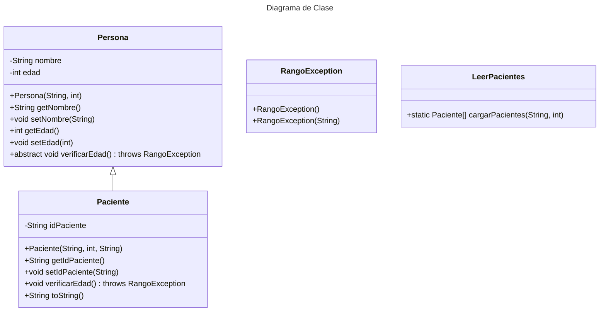

# Proyecto - Gestion de Excepciones

## Objetivo del Proyecto
Se espera destacar los aspectos clave como la gestión de información de pacientes, el uso de programación orientada a objetos, el manejo de excepciones y la implementación de pruebas unitarias.

## Estructura del Proyecto
### El proyecto contiene las siguientes clases:

*Persona:* Clase abstracta que representa una persona con nombre y edad.

*Identificable:* define un método que debe ser implementado por cualquier clase que desee proporcionar una forma de obtener un identificador único. En este caso, la clase Paciente implementará esta interfaz para proporcionar su identificador de paciente.

*Paciente:* Clase que hereda de Persona y añade un identificador de paciente. Implementa el método verificarEdad.

*RangoException:* Excepción personalizada para manejar edades no válidas.

*LeerPacientes:* Clase con un método estático para cargar pacientes desde un archivo.

*Principal:* Clase principal que ejecuta el programa.

### Archivos
*pacientes.txt:* Archivo de texto que contiene los registros de pacientes.
AppTest.java: Archivo de pruebas unitarias para la clase Paciente.

## Diagrama de clases
[Editor en línea](https://mermaid.live/)

[Referencia-Mermaid](https://mermaid.js.org/syntax/classDiagram.html)

## Diagrama de clases UML con draw.io
El repositorio está configurado para crear Diagramas de clases UML con ```draw.io```. Para usarlo simplemente agrega un archivo con extensión ```.drawio.png```, das doble clic sobre el mismo y se activará el editor ```draw.io``` incrustado en ```VSCode``` para edición. Asegúrate de agregar las formas UML en el menú de formas del lado izquierdo (opción ```+Más formas```).

## Uso del proyecto con make

### Default - Compilar+Probar+Ejecutar
```
make
```
### Compilar
```
make compile
```
### Probar todo
```
make test
```
### Ejecutar App
```
make run
```
### Limpiar binarios
```
make clean
```
## Comandos Git-Cambios y envío a Autograding

### Por cada cambio importante que haga, actualice su historia usando los comandos:
```
git add .
git commit -m "Descripción del cambio"
```
### Envíe sus actualizaciones a GitHub para Autograding con el comando:
```
git push origin main
```
## Comandos individuales
### Compilar

```
find ./ -type f -name "*.java" > compfiles.txt
javac -d build -cp lib/junit-platform-console-standalone-1.5.2.jar @compfiles.txt
```
Ejecutar ambos comandos en 1 sólo paso:

```
find ./ -type f -name "*.java" > compfiles.txt ; javac -d build -cp lib/junit-platform-console-standalone-1.5.2.jar @compfiles.txt
```


### Ejecutar Todas la pruebas locales de 1 Test Case

```
java -jar lib/junit-platform-console-standalone-1.5.2.jar -class-path build --select-class miTest.AppTest
```
### Ejecutar 1 prueba local de 1 Test Case

```
java -jar lib/junit-platform-console-standalone-1.5.2.jar -class-path build --select-method miTest.AppTest#appHasAGreeting
```
### Ejecutar App
```
java -cp build miPrincipal.Principal
```
Los comandos anteriores están considerados para un ambiente Linux. [Referencia.](https://www.baeldung.com/junit-run-from-command-line)
